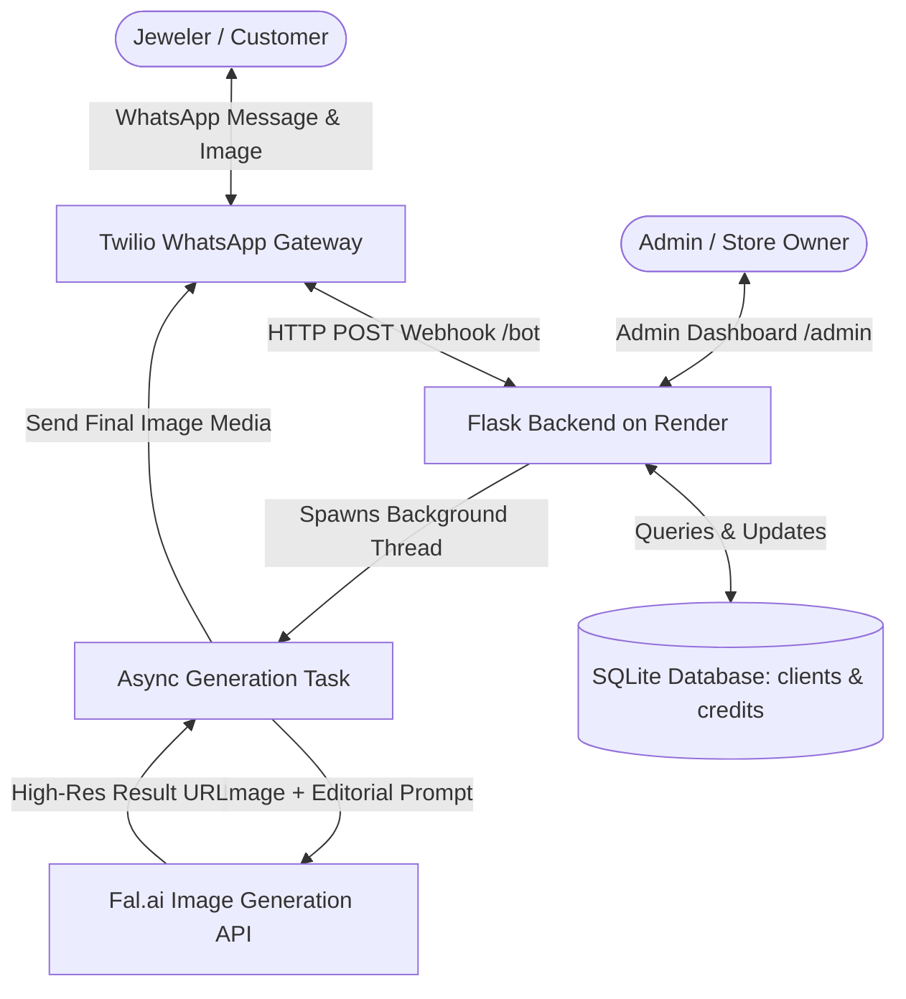
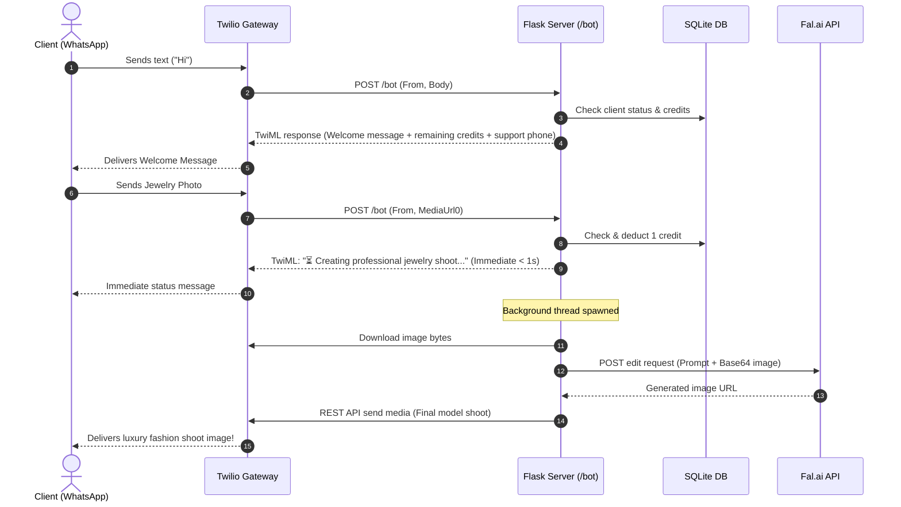

# Building "jewel tara": AI WhatsApp Jewelry Shoot Bot
### A Complete End-to-End Development Guide & Learning Tutorial

---

## 1. Project Overview & Problem Statement

### The Problem
Traditional jewelry photoshoot campaigns are extremely expensive and slow for small/medium jewelry businesses. Hiring professional models, high-end studio lighting, makeup artists, photographers, and retouching can cost thousands of dollars per shoot.

### The Solution
**jewel tara** is an automated WhatsApp Bot that transforms a single raw jewelry product picture into a high-end luxury editorial model shoot in seconds.

Jewelers or customers simply send a photo of a piece of jewelry on WhatsApp, and the bot:
1. Identifies the jewelry type (necklace, ring, bangle, earring, etc.).
2. Uses Generative AI (Fal.ai Nano Banana / image-to-image pipeline) to generate a photorealistic fashion model naturally wearing that exact piece.
3. Automatically deducts user credits, handles errors gracefully, and returns the finished high-resolution campaign image directly on WhatsApp.

---

## 2. System Architecture



---

## 3. Technology Stack & Why Each Was Chosen

| Component | Technology | Why We Used It |
| :--- | :--- | :--- |
| **Backend Framework** | **Python (Flask)** | Lightweight, easy to understand, minimal boilerplate for REST endpoints and webhooks. |
| **Messaging Channel** | **Twilio WhatsApp API** | Industry standard for WhatsApp Business messaging with media support and webhook integration. |
| **AI Image Model** | **Fal.ai (`fal-ai/nano-banana-2/edit`)** | Ultra-fast image-to-image transformation capable of preserving intricate jewelry design fidelity. |
| **Database** | **SQLite** | Zero-configuration serverless SQL database, ideal for tracking client allowlists and credits. |
| **Asynchronous Worker**| **Python `threading.Thread`** | WhatsApp webhooks require immediate HTTP responses (< 15 seconds), while AI generation takes 10–30s. Background threads prevent timeouts. |
| **Production Server** | **Gunicorn** | Production-ready WSGI HTTP server to handle concurrent connections. |
| **Cloud Hosting** | **Render** | Fast, free-tier friendly cloud deployment platform with automatic GitHub CI/CD. |

---

## 4. End-to-End User & Data Flow



---

## 5. Key Engineering Concepts (For Students)

### 1. Webhooks vs. Polling
Instead of our server constantly asking WhatsApp *"Are there any new messages?"* (polling), Twilio uses a **Webhook**. Whenever someone messages your WhatsApp business number, Twilio makes an **HTTP POST** request to your server's `/bot` route.

### 2. Solving Webhook Timeouts with Background Threading
> [!IMPORTANT]
> **The 15-Second Rule:** Twilio expects your server to respond with HTTP 200 within ~15 seconds. If your server is busy waiting for an AI model (which might take 20–40 seconds), Twilio will close the connection and throw an HTTP 504 / 11200 timeout error.

**How we solved it:**
1. When an image arrives, the server immediately deducts a credit.
2. The server responds to Twilio immediately with an acknowledgement message:
   `⏳ Creating professional jewelry shoot...`
3. The heavy task of calling Fal.ai is handed off to a background thread (`threading.Thread(target=process_editorial_shoot)`).
4. Once the AI finishes, the thread uses the Twilio REST SDK (`client.messages.create`) to push the image to the user asynchronously!

### 3. Credit Protection & Auto-Refunds
In distributed systems and external API integrations, network errors or model failures will happen.
- **Deduct First:** To prevent abuse, a credit is reserved before starting the GPU workload.
- **Refund on Failure:** If downloading the image fails or Fal.ai throws an error, the code immediately invokes `refund_credit(user)` and alerts the user so they are not charged for failed runs.

### 4. Database Concurrency & Thread Safety
Because background threads and HTTP requests access the database at the same time:
- We use a Python `threading.Lock()` (`db_lock`) when creating or modifying shared database structures.
- SQLite connections are opened and closed inside `try...finally` blocks per request/thread, preventing leaked database handles.

---

## 6. Prompt Engineering for Commercial Jewelry Shoots

Generative AI models often change jewelry details or create surreal fantasy elements unless strictly constrained. Here is the exact prompt strategy used in `app.py`:

```text
1. Analysis Step: Identify whether the item is a ring, necklace, pendant, bracelet, earrings, etc.
2. Model Placement: Place it naturally on the appropriate anatomy (neck, earlobe, hand, wrist).
3. Fidelity Preservation Rules:
   - keep the exact design and structure
   - keep metal finish, reflections, and color
   - keep exact gemstones and craftsmanship
   - do not redesign or simplify
4. Aesthetic Directive:
   - luxury brand campaign quality (Vogue editorial style)
   - realistic lighting and skin/clothing interaction
   - physically believable scale and fit
5. Negative Constraints:
   - no flat lays
   - no mannequins
   - no fake pasted or floating elements
```

---

## 7. Step-by-Step Implementation Guide

### Step 1: Set Up Python Environment
```bash
python3 -m venv venv
source venv/bin/activate  # On Windows: venv\Scripts\activate
pip install -r requirements.txt
```

**`requirements.txt`**:
```text
Flask
requests
twilio
python-dotenv
gunicorn
```

---

### Step 2: Configure Environment Variables
Create a `.env` file from `.env.example`:
```ini
FAL_KEY=your_fal_api_key
TWILIO_SID=your_twilio_account_sid
TWILIO_TOKEN=your_twilio_auth_token
ADMIN_API_KEY=your_secure_admin_passkey
SUPPORT_PHONE=7904070979
```

---

### Step 3: Core Backend Implementation (`app.py`)

#### A. Database Initialization
```python
def init_db():
    with db_lock:
        conn = get_db_connection()
        try:
            conn.execute("""
                CREATE TABLE IF NOT EXISTS clients (
                    phone_number TEXT PRIMARY KEY,
                    name TEXT NOT NULL,
                    status TEXT NOT NULL DEFAULT 'active',
                    remaining_credits INTEGER NOT NULL DEFAULT 0,
                    created_at TEXT NOT NULL DEFAULT CURRENT_TIMESTAMP,
                    updated_at TEXT NOT NULL DEFAULT CURRENT_TIMESTAMP
                )
            """)
            conn.commit()
        finally:
            conn.close()
```

#### B. The Webhook Handler (`/bot`)
```python
@app.route("/bot", methods=["POST"])
def bot():
    resp = MessagingResponse()
    msg = resp.message()

    media_url = request.values.get("MediaUrl0")
    user = request.values.get("From")
    client = get_client(user) if user else None

    # 1. Verification & Access Control
    if not client:
        msg.body(f"Welcome to jewel tara! 💎\nMee WhatsApp number onboard avvaledu. Support: {SUPPORT_PHONE}")
        return str(resp)

    if client["status"] != "active":
        msg.body(f"Mee access ippudu inactive ga undi. Support: {SUPPORT_PHONE}")
        return str(resp)

    # 2. Image Processing Workflow
    if media_url:
        updated_client, error = consume_credit(user)
        if error == "no_credits":
            msg.body(f"Mee credits aipoyayi. Credits recharge kosam support: {SUPPORT_PHONE}")
            return str(resp)

        # Immediate acknowledgement to Twilio to avoid timeout
        msg.body(
            "⏳ Creating professional jewelry shoot...\n"
            f"Remaining credits: {updated_client['remaining_credits']}"
        )
        # Background execution
        threading.Thread(
            target=process_editorial_shoot,
            args=(user, image_base64),
            daemon=True
        ).start()
    else:
        # 3. Welcome Message when user sends plain text
        msg.body(
            "Welcome to jewel tara! 💎\n"
            "Please send a clear jewelry image to create a luxury model shoot.\n\n"
            f"Remaining credits: {client['remaining_credits']}\n"
            f"Support: {SUPPORT_PHONE}"
        )

    return str(resp)
```

---

### Step 4: Admin Dashboard (`/admin`)

To make managing clients easy without needing SQL queries, the application includes a clean dashboard:
- Protected via `?admin_key=YOUR_KEY`
- Allows onboarding new client phone numbers in `whatsapp:+<country_code><number>` format
- Allows adjusting remaining credits and toggling active/inactive status.

---

## 8. Local Testing with Ngrok

Because Twilio needs a public URL to send webhooks to your local machine during development:

1. Start your Flask server:
   ```bash
   python app.py
   ```
2. In a separate terminal, start an **ngrok** tunnel:
   ```bash
   ngrok http 5000
   ```
3. Copy the HTTPS forwarding address (e.g. `https://xxxx.ngrok-free.app`).
4. Go to **Twilio Console** -> **Messaging** -> **WhatsApp Sandbox Settings**.
5. Paste `https://xxxx.ngrok-free.app/bot` into **WHEN A MESSAGE COMES IN** and save!

---

## 9. Deploying to Production on Render

1. **Push Code to GitHub**:
   ```bash
   git add .
   git commit -m "Initial commit"
   git push origin main
   ```
2. **Create Render Web Service**:
   - Connect your GitHub repo.
   - **Build Command:** `pip install -r requirements.txt`
   - **Start Command:** `gunicorn app:app`
3. **Set Environment Variables in Render**:
   - `FAL_KEY`
   - `TWILIO_SID`
   - `TWILIO_TOKEN`
   - `ADMIN_API_KEY`
   - `SUPPORT_PHONE`
4. **Update Twilio Webhook**:
   - Point the Twilio WhatsApp webhook to `https://<your-render-app>.onrender.com/bot`.

---

## 10. Student Exercises & Project Extensions

If students want to expand this project further, here are great ideas:

1. **Persistent Database:** Migrate from SQLite to a managed PostgreSQL database (e.g., Supabase, Render Postgres) so data persists across free instance restarts.
2. **Multiple Shoot Themes:** Allow users to type `editorial`, `traditional`, `minimalist`, or `outdoor` as a caption with their photo to pick custom aesthetic prompts!
3. **Automated Payments:** Integrate Stripe or Razorpay webhook so users can purchase credits automatically on WhatsApp!
4. **Watermarking:** Use Pillow (`PIL`) to stamp the jewelry store's logo onto the corner of the output shoot before sending it back.
